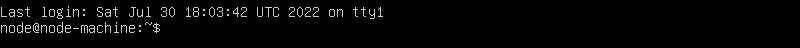
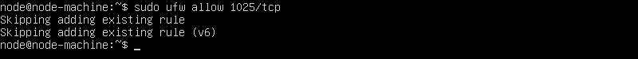
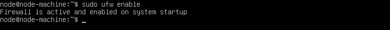

# Part 1 - Setup Node Machine

Required equipment:
* USB Drive for Ubuntu Server installation
* Node Machine
* Personal computer


##  Hardware
### Minimum Requirements
These are the minimum hardware requirements for a node machine. Always check [LUKSO's documentation](https://docs.lukso.tech/networks/l16-testnet/run-node#system-requirements) for updates.

* **OS:** Linux or Mac 
* **CPU:** 2 cores
* **RAM:** 16GB
* **Storage:** 100GB SSD (solid state is required)

For a future-proof setup, you may wish to choose a system with 4 cores, a 2.8GHz processor, 1TB of SSD storage, and 32GB of RAM.

### Example Hardware
Mini PCs are designed for 24/7 use and low power consumption, making them ideal for running a LUKSO node. The Intel NUC mini PC line is a common choice within the community. Below are the specs and pricing of three different NUC models.


|           | Intel NUC 10 (Minimum)         | Intel NUC 10 |Intel NUC 10 Performance Kit|
| --------  | --------                           | -------- |-----
| Processor | i3 2-cores                         | i5 4-core| i7 6-core
| RAM       | 16GB                               | 16GB     | 32GB
| Storage   | 256GB                         | 512GB |1TB
| Price     | $489                               | $629     |$949
| Link      | [Amazon](https://a.co/d/3g1vg6G)   | [Amazon](https://a.co/d/1UdrolU)     |[Amazon](https://a.co/d/iE7niEu)

A backup system (or parts) is also something to consider. If your node is offline, you will incur slashing penalties roughly equal to the rewards you would have gained while being online. For example, if you average 1 LYX per day in rewards, you will lose 1 LYX per day if offline.

## Step 1 - Install Ubuntu Server

This guide will follow the steps for Ubuntu 22.04 LTS **Server** as our node operating system, and we will interact with the node remotely from a personal computer/laptop. 

You have the option to install the desktop version of Ubuntu and operate the node like a desktop computer with a keyboard, mouse and monitor attached. However, there are a number of reason to choose a server installation for you node.

* **Security** - Most importantly, it is best security practice to run **only** the software needed to operate a node. To setup, troubleshoot, and maintain your node, you will rely on a web browser to follow guides and chat applications (like Discord) for community support. With remote access, you can use these application from your personal computer, and simply copy/paste commands into the SSH terminal.

* **Performance** - Ubuntu Desktop uses more system resources. Ubuntu Server makes more resources available to your node software.

* **Convenience** - Your node should be **wired** to your network, not connected through WiFi. Remote access removes the need to keep a keyboard and monitor connect to you node and allows you to place your node hidden away near your router. Only two connections are needed, one to your router and one to an electrical outlet.

Also, with SSH enabled, you can easily setup access to your from remote locations, allowing you to perform maintenance and troubleshooting from anywhere with an internet connection.


Using Server + remote SSH access from a personal computer instead of directly attaching a keyboard/monitor to your node has security and performance benefits and also adds convenience. 

- Nodes should not run unnecessary software, like web browsers needed to follow guides, or messaging platforms used for community support.
- The temptation to use the node for other purposes is removed
- The Desktop GUI consumes system resources
- You can place the node next to your router and avoid running wires.
- You can easily configure access to your node from remote locations by enabling a VPN server.
 

### 1.1 - Create a bootable USB stick

#### Requirments
* 4GB or larger USB flash drive
* A personal computer


#### Follow these steps to download the ISO file and image the USB flash drive:

1. Visit the [Ubuntu Server](https://ubuntu.com/download/server) download page.
2. Choose "Option 2 - Manual Installation"
3. Choose "Download Ubuntu Server 22.04 LTS"
4. Follow the guide on Ubuntu's website. Choose the appropriate guide below for your personal computer's operating system. You still start with step 3
* [Windows guide](https://ubuntu.com/tutorials/create-a-usb-stick-on-windows#3-usb-selection)
* [macOS guide](https://ubuntu.com/tutorials/create-a-usb-stick-on-macos#3-prepare-the-usb-stick).


### 1.2 - Install the server

1. Attach a monitor and keyboard to your node machine. 
2. Follow [Ubuntu's official guide](https://ubuntu.com/tutorials/install-ubuntu-server#1-overview) to install the operating system. After step 14 is complete, and the system reboots, you should see a login screen.
  
3. Login with the username and password created during the installation. After a successful login, you should see a `$` prompt.

 
 
4. Update the server with these three commands before proceeding. Type the command --> press `Enter`.

```
sudo apt update
```
```
sudo apt upgrade -y
```
```
sudo apt install -y 
```

5. Install the Nano text editor.
```
nano wget make git
```

## Step 2 - Configure Settings
These steps will need to be typed into your node terminal to prepare for remote access. In part two, we will be able to copy/paste all commands.

### 2.1 - Open the SSH config file
```
sudo nano /etc/ssh/sshd_config
```


### 2.2 - Change SSH Port Number

The default SSH port (22) should be changed to a random number for security reasons.

1. Find `#Port 22`
2. Remove the `#`
3. Choose a number between 1024 thru 49141
4. Replace `22` with your number
5. Close editor by pressing `ctrl` + `X`, then save.

In this example, we are using port 1025


:::note
For the rest of this guide when you see `<ssh-port>` replace it with the number you chose in this step.
:::

6. Validate SSH configuration and restart ssh service.

```
sudo sshd -t
sudo systemctl restart sshd
```

### 2.3 - Configure firewall

#### 1 - By default deny all traffic

```sh title="type these command (one at a time)"
sudo ufw default deny incoming
sudo ufw default allow outgoing
```
Verify the output of the commands

#### 2 - Allow SSH access
For this command, replace `<ssh-port>` with the number you chose in step 2.2
```sh title="type this command"
sudo ufw allow <ssh-port>/tcp
```
Verify the output of the command


#### 3 - Enable firewall
```sh title="type this command"
sudo ufw enable
```
Verify the output of the command


#### 4 - Confirm firewall settings
```sh title="type this command"
sudo ufw status
```
Verify the output of the command


## Step 3 - Configure Auto Start

It is important to set up your node to power on automatically after a power outage. The setting is usually found in the BIOS, but some systems use a jumper on the motherboard. Refer to your hardware manual for instructions.
### 3.1 - Shut down the node machine
```sh title="type this command"
sudo shutdown -h now
```
### 3.2 - Configure BIOS
To enter the BIOS, you must press a key on the keyboard just after the machine is powered on. It is often `F2` but can vary from system to system.

For Intel NUC, follow these steps:
1. Power on your node machine
2. Press F2 before the server boots to enter BIOS setup
3. Go to `Power` -> `Secondary Power Settings` menu
4. Set the option for `After Power Failure` to `Power On`
5. Press F10 to save changes and exit BIOS
6. All you system to boot back to the login screen

### 3.3 - Test Settings
Test the setting by unplugging the power cord while the system is running. It should turn on and boot when you plug it back in.


## Step 4 - Reserve Node IP Address
Address reservation ensures your router always assigns the same IP address to your node. This step will require logging into the settings screen of your router. The steps are different for each manufacturer.

For these step, you will need your node machine and personal computer.

### 4.1 - Log in to router
1. Log in to your node machine
1. Determine your router's IP address.
```sh title="type this command"
ip route show default
```
3. On your personal computer, Open a web browser and enter the router's IP address.

A username and password prompt will appear. Login to access the router administrative console. If you do not now your credentials, you will need to reset your router. Refer to your router's manual for instructions on accessing the console.

### 4.2 - Configure Router
1. Determine the IP address of your node
```sh title="type this command"
hostname -I
```
2. Find the setting for reserving IP addresses. “DHCP Settings” or “DHCP Reservation” are common terms. Refer to your router’s manual for specific instructions.

3. Configure the router to reserve this address
4. Save the settings


---
References
- [Vlad's Guide](https://github.com/lykhonis/lukso-node-guide#auto-start)